### Introduction 
Making a simple bare-metal application sends a string using a UART channel using VersatilePB microcontroller based on arm926ej-s.

#### The objective in this lab  
dealing with cross-toolchain like arm toolchain, startup files and how to build it, and writing simple linker script for ARM architecture.
#### Tools
* Cross-toolchain : GNU ARM Cross-ToolChain
                    arm-none-eabi-gcc (GNU Tools for Arm Embedded Processors 7-2017-q4-major) 7.2.1 20170904 (release) [ARM/embedded-7-branch revision 255204]
### Development 

#### app.c
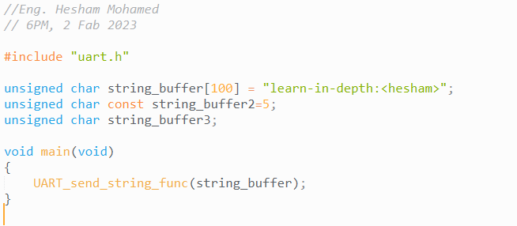

#### uart.c
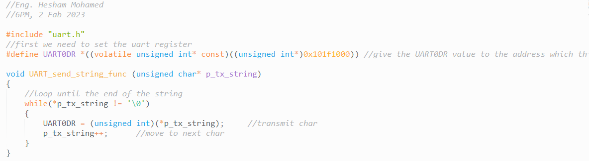 

#### uart.h
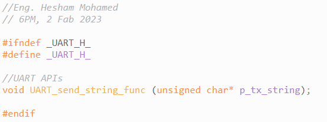

### Export ARM toolchain path
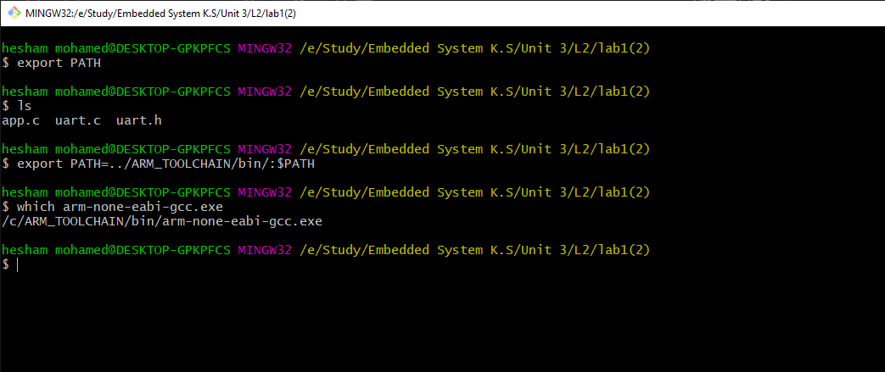

### Generate & navigate*.o files
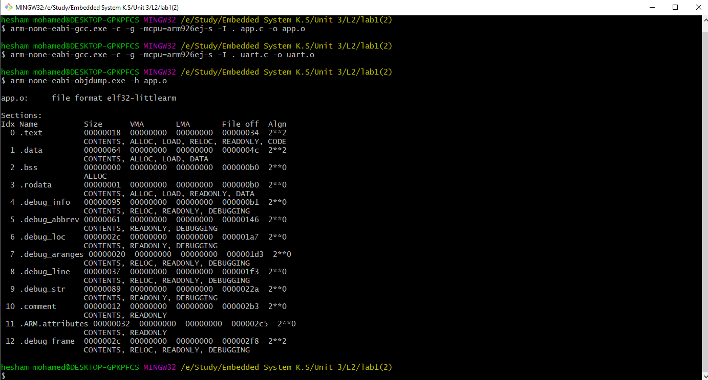
 * `arm-none-eabi-gcc.exe`: GNU Arm Embedded Toolchain is ready-to-use.  
 1) Options:    
    a) `-c` :  Compile and assemble, but do not link.  
    b) `-g` :  Enable debug information.  
    c) `-I` . : Header file exist in the same directory.   
2)  `-mcpu=arm926ej-s` : processor type.  
3) converte `.c` file to `.o` (Relocatable Binary), so we have 2 .c file app.c and uart.c so we compiled and assembled it.

* `arm-none-eabi-objdump.exe` : Toolchain binary utilities.  
1) `-h` : --[section-] headers  Display the contents of the section headers.  
2) Sections:   
    I) Vertical :   
        &emsp;a) `.text`:  assembly.  
        &emsp;b) `.data`: for global initialized data.   (exist in flash)  
        &emsp;c) `.bss` : for global/static uninitialized data. (Doesn't exist in flash add on RAM by knowing its size)  
        &emsp;d) `form 4 to 9` : debug info. 
        anothor sections :  
        &emsp;e) `.rodata` : form const data.  
    II) Horz. :   
         &emsp;a) `size`: the size of the section in bytes.  
         &emsp;b) `VMA`: Virtual Mem. address of the output section.  
         &emsp;c) `LMA`: Load Mem. address of the output section.

### View The assembler content of all sections
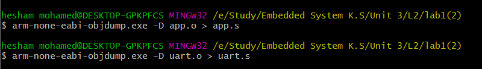
* `-D` :  Disassembly sections.

### startup file content   
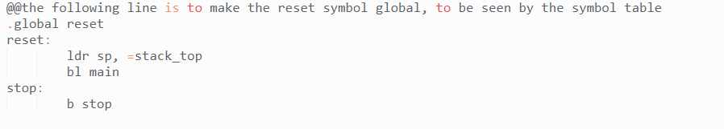  
1) `global` refers to the global section to be seen from other files.
2) Define sections like :  
    a) `reset` section to be executed first.    
        &emsp;    `ldr` --> load stack pointer to address stack_top (defined in linker script)  
        &emsp;    `bl` --> branch label to main  
    b) `stop` section will be executed after the execution of the reset section.  

### Compile & navigate startup file    
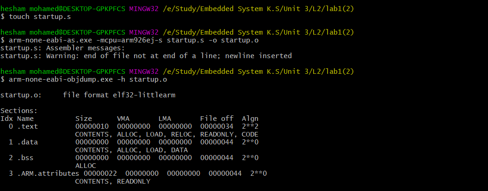  
 `arm-none-eabi-as.exe` : Toolchain binary utilities for assambler
 
### Linker-script content 
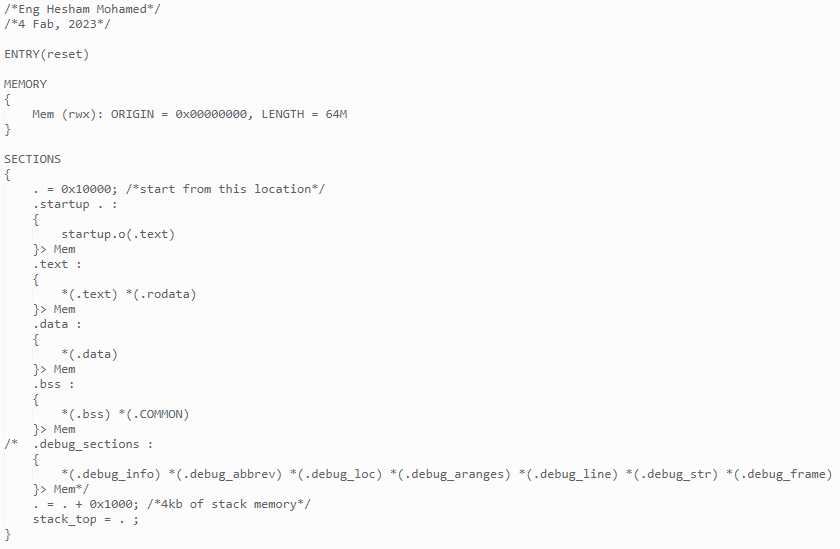

### Linking files with LinkerScript, navigate & analyze th eexecutable file
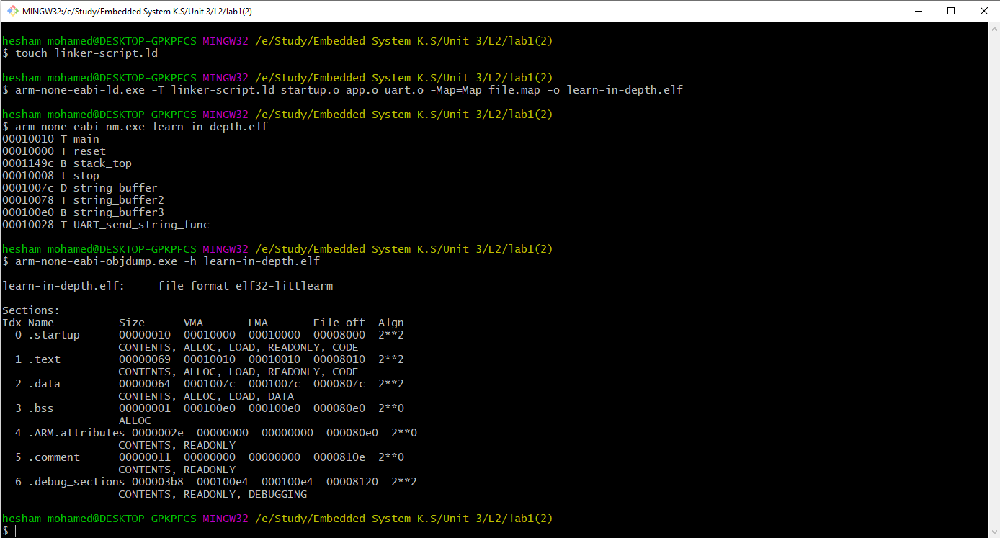  
* Target dependent
* `-T` argumant to pass our own linker script.  
* &emsp;`D` referse to Data section   
  &emsp;`T` referse to text section  
  &emsp;`U` referse to unresolved 
  all `symboles` are resolved
  
### Entry point and header sections 
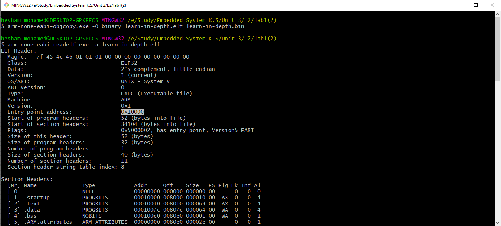  
as set in linker script  

### QEMU Simulation

  

